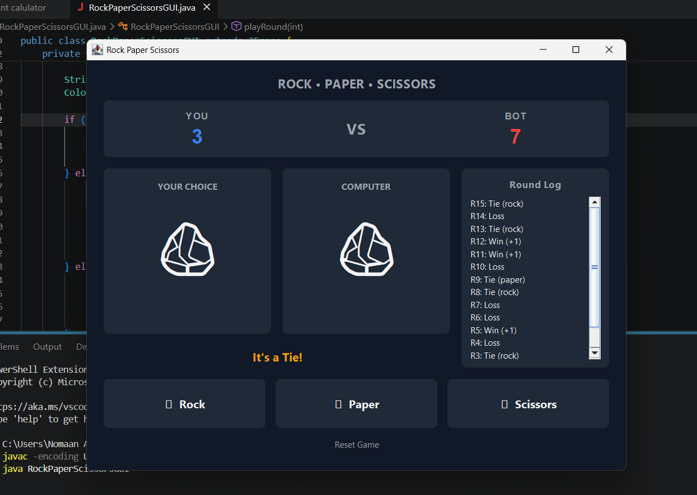

# 🪨 Rock • Paper • Scissors (Java)

A desktop Rock, Paper, Scissors game built with Java Swing. It features an interactive dark-mode user interface, real-time scoreboard, custom fighter display cards, and a chronological round log.

---

## 📸 Preview

<p align="center">
  
</p>

---

## ✨ Features

- **Modern Dark UI:** Custom styled interface built with anti-aliased rounded cards, slate palette, and responsive hover effects.
- **Side-by-Side Arena:** Dynamic fighter cards showing real-time player and computer choices.
- **Live Scoreboard:** Running win/loss counter updating with every decision.
- **Scrollable Round Log:** Detailed history panel tracking round outcomes (Wins, Losses, Ties) chronologically.
- **Zero External Dependencies:** Built entirely with standard Java SE (`javax.swing` and `java.awt`).
- **CLI & GUI Modes:** Includes both an interactive console version and a full graphical application.

---

## 🛠️ Requirements

- **Java Development Kit (JDK):** Version 17 or higher (tested on JDK 21 / 25)
- Any operating system with Java desktop support (Windows, macOS, Linux)

---

## 🚀 Getting Started

### 1. Clone the Repository
```bash
git clone [gh repo clone nomiyehh/RockPaperScissors]
